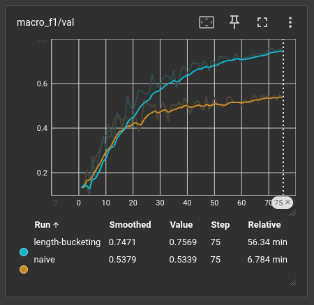
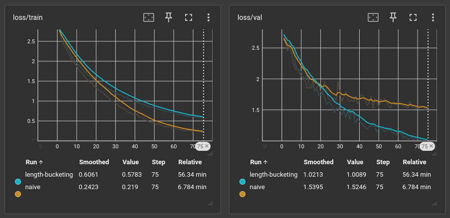

# Technical report of the bird call classifier project

## Introduction, scope and motivations

The project's scope was to train a VGG-style neural network to correctly identify specific bird species from polish fauna based on their call audio. The idea was motivated by early VGG implementations (around 2014) and their applications in data classification, especially image data.

For that reason, one particular quirk of our implementation is the way data is formatted before being fed into the network, as the model trains directly on images instead of audio, specifically mel-spectrograms. Therefore, it is fundamentally an image classification model, rather than an audio one.

The trained model allows for inference of custom user-inputted audio, and we managed to succesfully identify a live bird recording from a nearby forest.

## Data acquisition

The first step of the pipeline is acquiring the raw training data, which takes form of short (up to 30 seconds) audio clips, downloaded from [xeno-canto](https://xeno-canto.org/) website. The upper time bound was specified during the API calls to avoid fetching lengthy clips, which slowed down the download process.

### Concerns about audio quality difference

The dataset is defined as 18 species with 200 recordings each, which proved to be enough for decent training of the model. One concern regarding the usability of the model trained on xeno-canto data steemed from possible differences in quality of recording hardware. Because the xeno-canto community consists of many dedicated wildlife observers and ornitologists, we hypothesized whether the average upload might utilize a high-quality recording hardware (possibly with some variants of built-in noise reduction). Training a model solely on such clean data could result in a system which would prove inefficient when presented noisy, phone-recorded audio, which was what we used.

For that reason, there were debates whether data would require adding artificial noise or artifacts during preprocessing. Fortunately that didn't prove to be a major issue in the final scenario, possibly because many xeno-canto recordings are uploaded by amateurs with hardware capabilities similiar to the team.

## Data preprocessing

### Conversion to mel-spectrograms

After downloading, raw data is converted to 2D arrays representing mel-spectrograms, a common way of storing audio used for classification. The spectrograms are images visualising the time change on the X-axis, and the particular target frequencies on the Y-axis, with individual pixels indicating the power of a specific frequency during a specific time frame. The arrays are stored as numpy matrices in the .npy format.

By default, after converting, the matrices have varying dimensions, as the matrices representing clips shorter in length naturally have shorter time frames (for example, a 30 second clip could get converted to an array of 128x128, while a 15 second one could get 128x64). Varying array length is actually not a problem for the training code specifically, as our implementation allows for varying matrix dimensions. However, batching requires the matrices loaded to GPU to match in dimensions. Because of that, mismatched lengths effectively force the batch size to one, disabling the main advantage of GPU parallelism. This would effectively force us to a CPU-style training only, which is very inefficient.

### Different approaches to batching problem

Efficient training required finding a way to ensure the arrays in a single batch are the same size. The original project description suggests setting all spectrograms to 128x128 resolution, however ultimately a different approach was taken.

#### Issue with time-stretching

The first idea was to use Python's librosa library to stretch shorter audios on the time-axis to match the desired length of 30 seconds. However, clips of varying length would then get stretched by varying factors, which would introduce inconsistent resolution (compression) across samples.

For example, using hop_length of 512, a clip with real length of 30 seconds would get originally transformed to ~1292 mel time bins whereas a clip with real length of 5 seconds would get transformed to only ~215 mel time bins. This would result in inconsistent resolution on the time-axis, as a column of the first matrix would span six times smaller amount of real time than the same column of the second matrix one, which would heavily hurt training.

#### Silence padding

Therefore, the approach we have decided to utilize is padding the shorter clips with silence right-side (from the end of the audio) to match the desired length. This solved the mismatched dimensions problem, however careless padding led to another issue. Because the padding always occured on the right-side, significant portion of processed clips contained valuable data only in the early parts of the clip (near the beginning, or, in the first rows of the matrix), and later timeframes were interpreted as silence. This led to model learning an incorrect pattern of valuable events occuring mostly in the early parts of audio clips, so events occuring near the end might often get ignored. This implementation of pre-processing was named "naive" padding strategy.

An alternative strategy was developed, named "length-bucketing". Because separate batches can differ in matrix sizes, with important factor being only for the matrices in an individual batch to match in dimensions, audio clips in a single batch need to be padded only relative to each other. For example, with the longest clip having the length of 20 seconds and the shortest having length of 16 seconds, the maximum amount of padded silence required is only 4 seconds, which is much less influential on the training process than average padding applied in the "naive" strategy. Therefore, the strategy implements grouping (bucketing) spectrograms of similiar width to be loaded to one batch, minimizing the amount of padding required.

Another strategy to be tested was named "masked-gap", which consisted of the approach of "naive" strategy combined with masking of artificial silence regions in the GAP layer, before the fully-connected layers of the network. This in theory allowed for almost complete negation of the padding problem while still allowing for utilising GPU pararellism, however due to issues with GPU accesibility, the team lacked time to explore it.

#### Naive vs length-bucketing padding

As estimated, length-bucketing based padding led to significantly better training results, at the cost of longer training time, due to the necessity of finding audio clips of similiar length for grouping.
Therefore, it is the approach used by default in the training script.

## Network architecture

The core network architecture is a modified version of classic VGG implementation described in [Simonyan & Zisserman 2014 paper](https://arxiv.org/abs/1409.1556), with some modern adjustements to ensure stabler and faster training.

#### VGG-blocks

The convolution part consists of 4 VGG-blocks, each constructed of two stacked 3x3 convolutions, each with it's own ReLU layer,followed by standard max pooling layers. Using two 3x3 filters results in a receptive field of 5x5, but with fewer parameters and additional nonlinearity due to extra activation layer.
Between the two convolution layers, a BatchNorm is added to normalize each feature channel (rescaling via computed mean and variance), ensuring the activations stay in stable range. This improves traning speed by reducing the risk of vanishing / exploding parameters, as well as apply mild regularization. This adjustement was proposed by [Ioffe & Szegedy in 2015](https://arxiv.org/abs/1502.03167).
Stride hyperparameter being set to value of 2 results in each block downsampling the initial input by half (halving height and width). In exchange, a copy of channels is created, returning in later layers having lower spatial dimensions but increasingly more channels.

[Chapters 22-25 (CNNs)](https://bnaskrecki.faculty.wmi.amu.edu.pl/nnets/_build/html)

#### Non-convolution layers

After 4 VGG-blocks, a Global Average Pooling layer is implemented, averaging values from all remaining spatial positions. Original Simonyan / Zisserman VGG used multiple fully connected layers instead, which spanned significantly more parameters (4096 neurons each by default). This worked well for larger and more complex ImageNet data, but would risk significant overfitting for smaller mel-spectrograms. Also, because of variable-length spectrogram implementation, fully connected layers would require extra workarounds to accept inputs of differing sizes, whereas GAP layer sums everything to a vector with dimensions of \[B, 256, 1, 1\] (batch, channel, height, width).

After the GAP layer, the implementation doesn't differ much from original, with required flatten layer followed by a dropout layer for regularization, which finally leads into a single fully connected layer returning raw logits for each class, which are then fed to a softmax function and outputted as estimated probabilities.

#### Example

| Stage | Output shape | Description |
--------|--------------|-------------|
| Input | (B, 1, 128, 128) | Log-mel image |
| Block 1 | (B, 32, 64, 64) | VGG-block 1 |
| Block 2 | (B, 64, 32, 32) | VGG-block 2 |
| Block 3 | (B, 128, 16, 16) | VGG-block 3 |
| Block 4 | (B, 256, 8, 8) | VGG-block 4 |
| AdaptiveAvgPool2d | (B, 256, 1, 1) | GAP layer |
| Flatten | (B, 256) | Feature vector |
| Dropout | (B, 256) | Regularization |
| Linear (Fully Connected) | (B, num_classes) | Returns raw logits |

*An example table showcasing the changing output shapes for each layer in BirdVGG with input of size 128x128 (matrix representing audio clip of 30 seconds) [matrix shape formatted as (batch_size, channels, height, width)\]*

## Training details and results

#### Hyperparameter specification

Training pipeline uses 75 epochs by default, though 50 seem valid as well for decent results. Initial learning rate is set to 1e-4, linearly decaying up to the value of 1e-5 (one tenth of the initial value) at the end of the training. This quite large learning rate value is acceptable given the relative low complexity of the subject problem. Training also implements weight decay value at 1e-4 for regularisation.

Optimizer used is AdamW, as the pretty-much default optimizer in modern deep learning. Data is split in proportions of 70/15/15 for training, validation and test subsets repsectively. [Chapter 27](https://bnaskrecki.faculty.wmi.amu.edu.pl/nnets/_build/html/part8_optimization/ch27_optimizers.html)

#### Training results

Out of two implemented batching strategies described before, "length-bucketing" consistently outperformed "naive" batching. However training via "length-bucketing" took substantially longer time, with interesting factor being that adding more classes actually ocassionally improved training time despite more data requiring processing. This is because the more data results in denser clip length distribution, which results in average batch requiring less padding and decreasing in width, which reduces input size.

Training was done on a single Nvidia GTX 1070 GPU, with naive strategy taking around 7 minutes and length-bucketing around 54 minutes for 75 epochs.

The primary graduation metric used is F-score, calculated as the harmonic mean of precision and recall, commonly used for measuring classification problems.

*Macro F1 over training with both strategies on 75 epochs.*

*Training and validation losses over training with both strategies on 75 epochs.*

## Inference

Running inference via the prediction scripts outputs 3 classes deemed with highest probabilty along with their percentages. To account for low confidence scenarios, the model also returns normalized Shannon's entropy, as well as the margin between probabilities of the first and second highest class. Uncertainty output was implemented, with correct identification requiring highest class probability being no lower than 30%, along with the margin no lower than 15%.

Because of the relatively large number of classes and natural noisiness of the audio recordings, it's rare to achieve a predicted probability higher than approximately 60%. Therefore, calculated entropy is often valued at around 0.5, which might misleadingly suggest low confidence, even with very high margin between the first and second most probable classes. For that reason, we recommend utilising the margin value over the classic entropy for measuring prediction confidence.

## Ending notes

We succesfully managed to train an audio classification model to recognize polish avian fauna based on the recordings of call audios. Improvements could be made in training speed, and it's possible that implementing some method of masking of the padded silence as well as additional data augmentation could improve the achieved results. Nevertheless, we're happy with the outcomes.